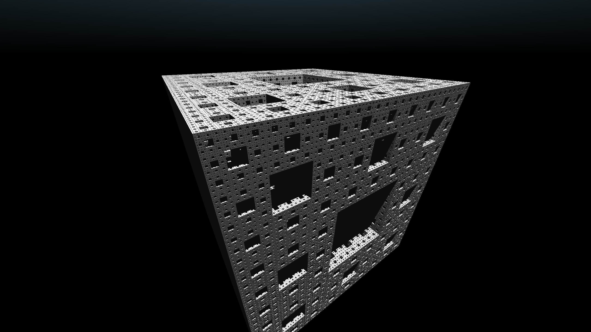

# Real time ray tracing using the ray marching technique

This project demonstrates 3d renderering including coloured lighting and reflection.
The loaded demo scene shows three reflective sphere illuminated with three lights of red, green and blue.

# Gallery

The top four were generated with the code in this repo, the others are from older generations of the project

